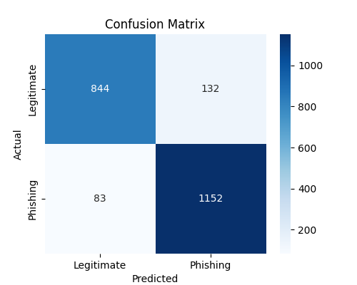
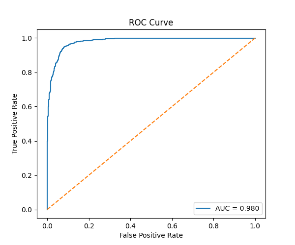

# Phishing URL Detector (AI + Cybersecurity Project)

Machine Learning-based phishing URL detector built using Logistic Regression and handcrafted cybersecurity features. The model achieves ~93% accuracy on a dataset of 11,000+ URLs and supports real-time command-line predictions.

---

## Features

- Logistic Regression phishing detection model
- ~93% classification accuracy
- Command-line URL prediction support
- Feature importance analysis
- Saved trained model using joblib
- Real-time URL structure inspection

---

## Dataset

The dataset contains 11,000+ URLs with 30 phishing indicators such as:

- HTTPS usage
- URL length
- presence of @ symbol
- prefix-suffix in domain
- IP address usage
- traffic indicators
- domain age signals

---

## Dataset Details

The model was trained on a phishing website dataset containing 11,000+ labeled URLs.

Each sample includes 30 handcrafted security-related features such as:

- HTTPS usage
- IP address presence
- URL length
- prefix-suffix usage
- domain age indicators
- traffic ranking signals
- Google indexing status
- anchor URL behavior

Target labels:

- 1 → Legitimate website
- -1 → Phishing website

Dataset source:
UCI Machine Learning Repository phishing dataset.

## Project Structure
phishing-url-detector/
│
├── dataset/
│ └── phishing.csv
│
├── src/
│ └── detector.py
│
├── phishing_model.pkl
├── requirements.txt
├── README.md
└── venv/

## Installation

Clone the repository:

git clone <your-repository-link>

# Install dependencies:

pip install -r requirements.txt

# Run the detector:

python3 src/detector.py https://example.com

## Example Output

python3 src/detector.py https://example.com
Checking URL: https://example.com
Legitimate website

---

## Model Details

Algorithm used:

- Logistic Regression

Accuracy achieved:

- ~93%

## Model Comparison

The following models were evaluated:

| Model | Accuracy |
|------|----------|
| Logistic Regression | ~93% |
| Random Forest | ~96% |

Although Random Forest achieved higher accuracy, Logistic Regression was selected for deployment due to its interpretability and coefficient-based feature importance analysis.
Logistic Regression → interpretability
Random Forest → performance boost
XGBoost was explored but omitted due to environment compatibility constraints.

## Confusion Matrix

This matrix shows how well the model distinguishes phishing vs legitimate URLs.

---

## ROC Curve

This curve evaluates classifier robustness across different decision thresholds.

## Streamlit Demo

## Future Improvements

- Add more phishing feature extraction rules
- Build web interface version
- Deploy as browser extension
- Integrate real-time threat intelligence APIs

---

## Author

Built as part of a self-driven AI + Cybersecurity learning project.